# Pulse — Core Design & Validation
29 sep 2026 · @Enzo

## Engine layers

The IR in the middle is the only contract: everything above writes it, everything below reads it. Nothing downstream is hand-edited once it can be generated.

```mermaid
flowchart TB
    L1["<b>1 · Frontends</b><br/>built: none · the one IR is hand-written in the example<br/>to build: Python · Modelica via Rumoca · FMI import"]
    L2["<b>2 · Pulse IR</b> · crates/pulse-ir · SEMANTICS.md<br/>built: written semantics · port-level graph · behaviour as data · components · units · firmware vs outside world · content hash<br/>to build: FSMs as data · NN blocks · delays and rational clocks in firmware"]
    L3["<b>3 · Checks</b><br/>built: Class 1, differentially tested · units · Class 3 invariants + ranges on the whole firmware · evidence report<br/>to build: rest of Class 1 · Class 2 · relational Class 3"]
    L4["<b>4 · WCET provider</b><br/>built: none · budgets are assumed, not proven<br/>to build: static bound per block"]
    L5["<b>5 · Codegen</b><br/>built: the whole firmware as one generated step()<br/>to build: hardware shim per target · physics code"]
    L6["<b>6 · Block library</b> · crates/pulse-joint<br/>built: generated firmware · hand-written controllers kept as test oracles · sensor model (simulation)<br/>to build: component library (PID, filters, FSMs)"]
    L7["<b>7 · Runtime targets</b><br/>built: host loop calling Firmware::step()<br/>to build: RP2350 · Cortex-M4F · optional Copper host"]
    L8["<b>8 · Interfaces</b><br/>built: none · the example prints a report<br/>to build: CLI · MCP server"]
    L9["<b>9 · Policy blocks + runtime assurance</b><br/>built: none<br/>to build: black-box policy · monitor · fallback"]

    L1 --> L2 --> L3 --> L4 --> L5 --> L6 --> L7 --> L8 --> L9

    classDef default fill:#fff,stroke:#000,color:#000
    linkStyle default stroke:#000
```

Read top to bottom: each layer builds on the ones above it. Everything built so far is a proof of concept on the single-joint example.

| # | Layer | What it does | Have | Build next |
|---|---|---|---|---|
| 1 | **Frontends** | Let people describe a system in the language they already use (Python, Modelica, FMUs) and emit the IR. Authoring only: never linked into the binary. | The single-joint IR written by hand in Rust. | A minimal Python frontend that writes the single-joint JSON (D-004). Then Rumoca for physics. |
| 2 | **Pulse IR** | The single source of truth, with its meaning written down in [SEMANTICS.md](SEMANTICS.md): firmware blocks (behaviour as data) and the outside world they talk to, port-level edges with holds, delays and age bounds, reusable components, units. Versioned and serializable, and validated on load because frontends and agents are untrusted. | Blocks, rates, holds, delays, sensor contracts, WCET budgets, JSON v4, `validate()`. Behaviour as a small total expression language read by one generic walk as f32 firmware, f64 model, interval proof and Rust source (D-007). Components with named, unit-carrying params; unit checking; the whole firmware composed into one step (D-008). | FSMs as data, NN blocks, delays and rational clocks inside firmware. |
| 3 | **Checks** | Prove properties from the IR without running it; a failure is a compile error that names the block or edge. Class 1: timing. Class 2: partitioning a continuous system didn't change it. Class 3: algebraic proofs over the whole parameter range. | Class 1: rate ratios and hyperperiod, a declared hold on every cross-rate read, a staleness bound on every edge, no zero-delay loops, per-tick budget. Differentially tested against a brute-force tick simulation on random IRs. Class 3: inductive state invariants and output ranges by f32-sound interval arithmetic, proved on the whole firmware for every input the contracts allow. `pulse_ir::evidence`: what is proved, assumed and not proved, bound to the IR's hash. | Relational invariants (today a relation must be stated, e.g. the integrator clamp), latency on paths rather than single edges. Class 2 after that. |
| 4 | **WCET provider** | Supply a real worst-case execution time per block, from the exact shipped binary and a hardware model, so "WCET ≤ budget" is proved rather than assumed. Pluggable: aiT, OTAWA, or measured (clearly labelled not a proof). | Only the budgets; host timings are indicative. | The provider interface in `pulse-ir` once the first real bound exists (D-001). |
| 5 | **Codegen** | Turn the IR into what the target executes: one `step()` per base tick, like SCADE/Lustre, plus a thin hardware shim, and the plant/physics code for simulation. | The whole firmware as one `no_std` `Firmware::step()`, golden-file tested, bit-identical to the IR interpreter and to the hand-written controllers it replaced. | The RP2350 hardware shim (timer interrupt, ADC, PWM). Physics code comes from Rumoca. |
| 6 | **Block library** | Reusable, verified behaviour: IR components (a PID today) and the generated `no_std` firmware. | `pulse-joint`: the generated firmware, the sensor model (simulation), and the hand-written controllers kept only as test oracles. | A component library (PID, filters, state machines) proved once per parameter set. |
| 7 | **Runtime targets** | Call the firmware step at the base rate. Host for development; bare-metal targets for real timing. | A host loop (RK4 plant, sensor model, `Firmware::step()`); the stall scenario is a regression test. Copper left the example (D-008). | RP2350 with cycle-counter probes (D-005 Stage 2). A Cortex-M4F board for static WCET (D-001 Track A). Copper as an optional host wrapper if logging/replay is wanted. |
| 8 | **Interfaces** | How people, CI and agents use the engine: reports with stable violation codes, and an MCP server so agents can propose edits that pass the same checks. | The `single-joint` binary report, `--ir-json` and `--evidence`. | A standalone CLI (`pulse check model.json`), a JSON Schema for the IR, then the MCP server (D-006). |
| 9 | **Policy blocks + runtime assurance** | Put learned policies in the loop as black boxes with a timing and interface contract, watched by a verified monitor that falls back to a checked controller. | Nothing yet. | Last, per "Next" below: it depends on every layer above being trustworthy. |

Pulse is one engine that composes continuous dynamics, discrete events, and state machines at multiple rates into a single intermediate representation, compiled to a deterministic binary. A real cyber-physical system — concretely, a robot — is never one formalism: a joint's electromagnetics and thermal state evolve continuously, a safety supervisor transitions discretely, and a scheduler dispatches work across seven different rates. Increasingly a learned policy sits in that loop too, with variable inference time and no formal guarantees.

The engine's job is to make the interactions between those layers checkable at compile time — an inference overrun, a sensor read at the wrong phase, a torque command that's thermally infeasible — instead of discovered on hardware. That's also why validation below relies on deterministic mathematical evidence rather than unit tests: a unit test confirms one input produced one correct output; it can't confirm a deadline always holds, or that a control law is stable everywhere it's allowed to operate.

## Engine core

### Engine core semantics

Every element of the system — a joint's dynamics, a supervisor's mode logic, a rate-limited sensor read — is a block in one intermediate representation. A block declares its own rate, its inputs and outputs, and which formalism it's written in; the compiler is what makes four formalisms interoperate instead of four separate tools.

| Formalism | What it contributes | Example block |
|---|---|---|
| Continuous (ODE/DAE) | Physics that evolves smoothly between samples | Motor electromagnetics, thermal model |
| Discrete / event-driven | State that changes only on a trigger | A fault latch, a mode change |
| State machine | Legal transitions between operating modes | Safety supervisor: idle → active → fault |
| Multi-rate scheduling | When each block runs, and what it's allowed to read | 8 kHz current loop nested inside a 200 Hz whole-body loop |

Two structural rules do the real work. First, every cross-rate read must be an explicit sample-and-hold — a block running at 200 Hz cannot silently read a value from an 8 kHz block mid-update; the read is a declared, timestamped operation with a known worst-case age. Second, the system must stay index-1: after partitioning, every algebraic loop must be solvable without differentiating a constraint, or the compiler rejects it rather than letting a solver silently degrade.

### Sensors and the inner/outer loop

The clearest instance of this composition is a single joint. An outer loop (planner or whole-body control, 200–500 Hz) sets a target for an inner loop (joint/current control, 1–8 kHz), which commands an actuator acting on a physical plant. Nothing in that chain talks to the plant directly — everything is mediated by a sensor model.

A sensor is not an ideal read of plant state. It is its own block, with a declared rate, a latency, a quantization step, a dropout probability, and a timestamp skew relative to whatever loop consumes it. The inner loop typically gets the sensor's full-rate, low-latency output; the outer loop gets a decimated, higher-latency version of the same measurement — two feedback paths with different declared timing, not the same signal read twice.

In order: outer loop → inner loop → actuator → plant → sensor. The sensor's full-rate output feeds back to the inner loop (fast path: 1–8 kHz, quantized and delayed); a decimated copy of the same measurement feeds back to the outer loop (slow path: 200–500 Hz). The two feedback paths are separate blocks with separate declared timing — not one signal read twice at two speeds.

### Where agent components plug in

A learned policy — a VLA emitting waypoints, an RL torque policy — is scheduled the same way as any other block, with one difference: it declares a worst-case execution time (WCET) budget instead of a proof of correctness. The scheduler treats it as a black box with a timing contract and an interface contract (what it may read, what it may write, what range its outputs must fall in); it doesn't need to trust what's inside.

That's deliberately the minimum. Bounding a policy's timing and interface is what makes runtime assurance possible later: a verified monitor can watch the policy's outputs and fall back to a checked recovery controller when they leave the declared envelope, without the engine needing to understand the policy itself.

## Validation framework

The engine is validated by construction, not by sampling test cases. A unit test says: for this input, the output was correct once. It says nothing about whether a deadline holds for every possible schedule, whether a control law is stable for every parameter in its declared range, or whether two blocks were ever silently reading the same rate-crossing signal at different phases. Those are universal claims, and a finite set of test cases can't establish one.

Instead, three classes of deterministic mathematical evidence are required, computed from the model itself rather than from executing it: temporal determinism, structural coverage, and symbolic mathematical proof. Each is either true of the whole system or the compiler refuses to build it — there's no partial credit, no "usually passes."

### Class 1: Temporal Determinism

Proves the schedule holds for every run, not just the ones that were traced.

| Check | What it verifies | How it's computed |
|---|---|---|
| WCET ≤ period | Every task meets its deadline on every rate, not just in observed runs | Static WCET analysis of the compiled task, compared against its declared period |
| Rational rate ratios | The task set has a finite, repeating schedule (a hyperperiod exists) | Checked at compile time from declared rates |
| Declared sample/hold on every cross-rate read | No block reads a value mid-update from a block at a different rate | Structural check on the IR's read/write graph |
| Measured jitter ≤ derived WCET | The compiled binary's real timing matches what was proved, not just simulated | Runtime trace compared against the static bound, on target hardware |

### Class 2: Structural Coverage

Checks that partitioning one continuous system into multiple rate groups didn't silently change what it computes or whether it's stable.

- Every equation appears in exactly one partition — nothing dropped or duplicated across rate groups.
- The system remains index-1 after partitioning — the split didn't introduce a differentiated constraint.
- Coupling between adjacent rate groups stays bounded:

  H ≤ τ_slow / 20

  where H is the fastest dynamic coupled into a slow group and τ_slow is that group's period — coupling faster than a twentieth of the slow rate is aliased, not tracked.

- The fixed-step integrator each rate group actually runs keeps its stability margin:

  ζ > (hω)³ / 8

  where h is the group's step size and ω is the fastest natural frequency it integrates — the margin an RK2 step needs to stay stable, computed symbolically from the partitioned model rather than found by trial simulation.

### Class 3: Symbolic Mathematical Proofs

Proves properties algebraically, from the model's equations and their derivatives, rather than by sampling numerically. It covers what the first two classes can't: unit consistency across every equation, that the solver's automatic-differentiation Jacobians are exact (not finite-difference approximations hiding a badly conditioned system), and that stability margins hold across the model's entire declared parameter range — not just the nominal values used in one simulation run.

These are compiler passes, not a separate audit step: a symbolic check that fails is a compile error, in the same place a type error would be, naming the offending equation and the violated property. v2 wraps the same checks in an agent loop for root-cause repair; v1 ships them as errors a person reads and fixes.

## Prior art and tooling

Every individual piece of this design has been tried before, separately. Nobody has fused them for robotics.

| Prior art | Proves | Gap that remains |
|---|---|---|
| Ptolemy II (UC Berkeley) | Composes continuous-time, discrete-event, and finite-state-machine models in one framework — the modeling idea works | Never compiled to a verified real-time binary; it's a Java simulator, not a production target |
| FMI | Physics as a validated, tool-independent component with a declared interface is already the industry standard — 280+ supporting tools, Bosch's preferred system-level exchange format | Says nothing about scheduling, timing, or proving what happens when components compose |
| BIP (Verimag) | Formally-verified real-time component composition, including a robot case study; 2025–26 work integrates it into NASA JPL's F Prime flight-software framework | Research tool — no acausal physics, no codegen to a production real-time target |
| AADL (SEI/Carnegie Mellon) | SAE-standard schedulability and timing analysis; DARPA's HACMS program used its contract-based compositional verification plus auto-codegen to build software a red team couldn't penetrate over six weeks | Discrete architecture only — no plant physics, the same gap the memo already flags for SCADE |
| Contract-based design (Sangiovanni-Vincentelli et al.) | Formal basis for proving a property holds across a model's whole declared uncertainty range | Active research, not a shipped compiler |
| ASTM F3269 (runtime assurance) | Real, adopted, actively-cited standard for a verified monitor overseeing an unverifiable controller | Defines the architecture, not a plant-aware implementation of it |

None of these are robotics-specific, and none combine acausal physics with clocked multi-rate scheduling in a hard-real-time compiled target. The closest non-robotics parallel is semiconductor design: static timing analysis under multi-corner process/voltage/temperature variation has, for decades, composed millions of individually characterized components and proven timing closure across their whole variation range, without the tool ever re-deriving transistor physics. That's the cleanest existing example of the division of labor this doc proposes.

| Package | Role | Why |
|---|---|---|
| Rumoca | Modelica frontend, AD Jacobians, codegen scaffold | Already chosen; does most of v1's physics-parsing work |
| diffsol | ODE/DAE solver | Already inside Rumoca's pipeline — reuse, don't reinvent |
| fmi (rust-fmi) | FMI 2.0/3.0 import and export in Rust | Makes "physics as a validated external component" real today, not aspirational — actively maintained, 41 stars, commits through August 2026 |
| multicalc | no_std real-time math: autodiff, Kalman/particle filters, PID/LQR, SE(3)/Lie groups, rigid-body dynamics loadable from MuJoCo MJCF, zero-order-hold discretization | Startlingly well-aligned: tested on six embedded targets including bare-metal ARM and RISC-V under QEMU, no heap, no panics, no unsafe, validated against numpy/scipy/filterpy to ~1 ulp. Its discretization module (zero-order hold, Van Loan) is close to the sample/hold semantics the IR needs |
| copper-rs | Compile-time task graphs, bare-metal target | Was the runtime; since D-008 the firmware is one generated step, so Copper is an optional host wrapper (logging, replay), not something proofs depend on |
| LLVMTA (Saarland) | Open-source, LLVM-IR-based WCET analyzer | The only open-source path to a real WCET bound found — AbsInt's aiT is the commercial industry standard, automotive-priced. LLVMTA is an active research group's tool, not a hardened product: a diligence item, not a settled dependency |
| Newton | Contact/rigid-body co-sim | Already chosen, unchanged |
| An SMT solver (z3 or lighter) | Rate-ratio consistency, cross-rate-read legality checks | No specific pick yet — Class 1 and Class 2's checks are exactly an SMT solver's wheelhouse |

None of this changes the roadmap. It's evidence for phase 0's three conversations, not a reason to skip them.

## Next

The open question isn't a roadmap phase — it's whether the four-formalism composition in the engine core above is right before more gets built on it.

1. Build the smallest example that exercises all four formalisms at once: a single joint with an 8 kHz current loop inside a 200 Hz position loop, a thermal state machine (nominal → derating → fault), and an explicit sensor model on the position feedback.
2. Get Temporal Determinism checking working on that one example before generalizing — it's the cheapest of the three classes and catches the most common real failure (the thermal-overrun story already reproduced in simulation).
3. Only then extend Structural Coverage and Symbolic Proof to the same example. Proving properties of a system that isn't even checked for basic timing is wasted work.
4. Leave agent/policy integration — WCET-budgeted black-box blocks — until the above is solid. It's the point of the engine, but it depends on everything above already being trustworthy.
